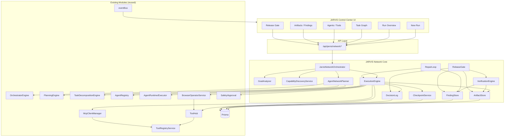

# JARVIS AGENT NETWORK — PHASE 3: TARGET ARCHITECTURE

> Generated: 2026-07-21
> Status: design document
> Constraint: reuse and extend existing modules; avoid parallel duplication

---

## 1. Current Orchestration Chain (AS-IS)

```
User message
→ /api/chat or /api/jarvis/orchestrate
→ jarvis-orchestrator.service.parseTask/executeTask
   (chat / analysis / repo_analysis / image / video / music / transcription)
→ OR
→ /api/jarvis/plan
→ jarvisRoleRouter.planTask
→ OrchestratorEngine.processMessage
→ PlanningEngine.classifyTask + createPlan
→ TaskDecompositionEngine.decompose
→ Prisma Project/Epic/Task/Subtask
→ ApprovalEngine (if risk)
→ ToolHub.executeTool (optional)
```

Problems for Agent Network goals:
- No explicit multi-step `OrchestrationRun`.
- No task dependency graph.
- No artifact/finding/checkpoint persistence.
- No structured AgentRequest/AgentResult contract.
- No Repair Loop or Release Gate.

---

## 2. Target Orchestration Chain (TO-BE)

```
User Goal
→ POST /api/jarvis/network/runs
→ JarvisNetworkOrchestrator.startRun(goal, constraints)
→ GoalAnalyzer.normalizeGoal
→ CapabilityDiscoveryService.listCapabilities
→ AgentNetworkPlanner.selectAgents + buildTaskGraph
→ AgentNetworkEngine.validatePlan
→ ExecutionEngine.executeReadyTasks
   → for each task:
      → build AgentRequest
      → assign to AgentExecutor / BrowserAgent / ToolHub
      → collect AgentResult
      → ArtifactStore.save
      → CheckpointService.save
      → QualityGateService.check
      → if failure → Finding.record → RepairLoop.queue
→ VerificationEngine.run
   → self-check
   → independent audit agent
   → typecheck / lint / build / tests
   → BrowserAgent.verify
→ RepairLoop.processFindings
→ ReleaseGate.decide
→ return RunReport
```

---

## 3. Component Diagram



---

## 4. Agent Contract

```typescript
interface AgentRequest {
  runId: string;
  taskId: string;
  agentId: string;
  mission: string;
  confirmedContext: Record<string, unknown>;
  inputArtifacts: ArtifactRef[];
  availableTools: ToolCapability[];
  allowedScope: string[];
  forbiddenActions: string[];
  expectedOutput: Record<string, unknown>; // JSON schema shape
  acceptanceCriteria: string[];
  verificationMethod: 'self_check' | 'independent_audit' | 'test' | 'browser' | 'manual';
  exitCriteria: string[];
  timeoutMs: number;
  maxRetries: number;
}

interface AgentResult {
  status: 'passed' | 'needs_review' | 'failed' | 'blocked';
  summary: string;
  completedTasks: string[];
  artifacts: ArtifactRef[];
  proposedChanges: ProposedChange[];
  changedFiles: string[];
  commandsRun: { command: string; exitCode: number | null }[];
  verificationEvidence: VerificationEvidence[];
  confirmedFindings: string[];
  assumptions: string[];
  unknowns: string[];
  blockers: string[];
  recommendedNextAction: string;
  durationMs: number;
}
```

Validation rules:
- `passed` is invalid if required artifacts are missing.
- `passed` is invalid if verification evidence is missing.
- `passed` is invalid if open critical blocker exists.
- Output must match `expectedOutput` shape.
- `forbiddenActions` violations downgrade status to `blocked`.

---

## 5. Tool Contract

```typescript
interface ToolDefinition {
  key: string;
  name: string;
  source: 'default' | 'skill' | 'mcp' | 'browser' | 'script';
  category: ToolCategory;
  description: string;
  inputSchema: ToolInputSchema;
  requiredPermission: ToolPermission;
  riskLevel: ToolRiskLevel;
  requiresApproval: boolean;
  available: boolean;
  unavailableReason?: string;
  timeoutMs: number;
  retryPolicy: { maxRetries: number; backoffMs: number };
}

interface ToolExecutionResult {
  success: boolean;
  data?: unknown;
  error?: string;
  metadata?: Record<string, unknown>;
  durationMs: number;
}
```

---

## 6. Task Graph

```typescript
interface TaskNode {
  id: string;
  runId: string;
  title: string;
  description: string;
  agentId: string;
  toolKeys: string[];
  dependsOn: string[];      // task IDs
  dependents: string[];     // derived
  status: TaskNodeStatus;
  priority: Priority;
  riskLevel: RiskLevel;
  artifactsIn: ArtifactRef[];
  artifactsOut: ArtifactRef[];
  findings: string[];       // finding IDs
  retryCount: number;
  checkpointId?: string;
  startedAt?: Date;
  finishedAt?: Date;
}

type TaskNodeStatus =
  | 'not_started'
  | 'ready'
  | 'in_progress'
  | 'verify'
  | 'passed'
  | 'failed'
  | 'blocked'
  | 'skipped';
```

Execution scheduler:
1. Build adjacency list from `dependsOn`.
2. Mark tasks with no dependencies as `ready`.
3. Run `ready` tasks sequentially by default; parallel only when explicitly allowed and independent.
4. On task completion:
   - `passed` → mark dependents, recalculate `ready`.
   - `failed` → record `Finding`, queue Repair Loop, block dependents unless marked optional.
   - `blocked` → block dependents.
5. Loop until no `ready` tasks remain.

---

## 7. State Machine

### OrchestrationRun

```
CREATED
→ ANALYZING
→ PLANNING
→ RUNNING
→ VERIFYING
→ REPAIRING  (loop back to RUNNING)
→ BLOCKED
→ FAILED
→ COMPLETED
→ CANCELLED
```

Transitions:
- `CREATED → ANALYZING`: after request validation.
- `ANALYZING → PLANNING`: after goal normalization and capability discovery.
- `PLANNING → RUNNING`: after task graph validation.
- `RUNNING → VERIFYING`: when all tasks `passed/skipped`.
- `RUNNING → REPAIRING`: when a finding is confirmed and fixable.
- `REPAIRING → RUNNING`: after applying minimal fix.
- `RUNNING → BLOCKED`: when a blocker cannot be auto-resolved.
- `RUNNING/VERIFYING → FAILED`: when max repair iterations exceeded.
- `VERIFYING → COMPLETED`: verification passed and Release Gate approved.
- Any → CANCELLED: user cancellation.

### TaskNode

```
not_started
→ ready
→ in_progress
→ verify
→ passed | failed | blocked | skipped
```

---

## 8. Shared Context

Stored per `OrchestrationRun`:

```typescript
interface RunContext {
  runId: string;
  goal: string;
  constraints: string[];
  assumptions: string[];
  confirmedFacts: string[];
  currentPlan: TaskGraph;
  artifacts: ArtifactRef[];
  agentReports: AgentResult[];
  decisions: DecisionLogEntry[];
  blockers: Blocker[];
}
```

Rules:
- No secrets stored.
- Truncated tool input summaries only (full input in `ToolExecution`).
- `DecisionLogEntry` records every important orchestrator choice.

---

## 9. Artifact Store

```typescript
interface Artifact {
  id: string;
  runId: string;
  taskId?: string;
  agentId?: string;
  type: 'plan' | 'spec' | 'code_report' | 'test_report' | 'audit_report' | 'browser_report' | 'release_report' | 'log';
  title: string;
  content: string;          // text/markdown/JSON
  metadata: Record<string, unknown>;
  fileRefs: string[];       // changed files
  createdAt: Date;
}
```

Persisted in Prisma via new `Artifact` table.

---

## 10. Decision Log

```typescript
interface DecisionLogEntry {
  id: string;
  runId: string;
  phase: string;
  decision: string;
  rationale: string;
  alternatives: string[];
  madeAt: Date;
}
```

Every significant orchestrator choice is logged:
- agent selection;
- tool selection;
- risk escalation;
- repair decision;
- release verdict.

---

## 11. Verification Pipeline

```typescript
interface VerificationResult {
  id: string;
  runId: string;
  type: 'self_check' | 'independent_audit' | 'test' | 'build' | 'lint' | 'typecheck' | 'browser' | 'security';
  status: 'passed' | 'failed' | 'not_run' | 'blocked';
  evidence: string;
  findings: string[];
  durationMs: number;
  createdAt: Date;
}
```

Pipeline order:
1. Self-check (quality gate on artifacts).
2. Independent Audit Agent review.
3. Typecheck (`npm run typecheck`).
4. Lint (`npm run lint`).
5. Unit/integration tests (`npm run test`).
6. Build (`npm run build`).
7. Browser Agent verification.
8. Security checklist.

Any step can be `not_run` if prerequisites are missing, but status must be honest.

---

## 12. Browser Agent

```typescript
interface BrowserAgent {
  verify(options: BrowserVerificationRequest): Promise<BrowserVerificationResult>;
}

interface BrowserVerificationRequest {
  runId: string;
  targetUrl: string;
  scenarios: BrowserScenario[];
  viewports: number[];
}

interface BrowserVerificationResult {
  status: 'passed' | 'failed' | 'not_available';
  inventory: BrowserInventory;
  consoleErrors: BrowserLogEntry[];
  failedRequests: BrowserNetworkEntry[];
  screenshots: string[];
  findings: string[];
  evidence: string;
}
```

Implementation:
- Wrap `BrowserOperatorService` with `BrowserAgentAdapter`.
- If Playwright browsers are not installed → status `not_available`, create manual matrix, do not block other work.

---

## 13. Repair Loop

```typescript
interface Finding {
  id: string;
  runId: string;
  taskId?: string;
  severity: 'P0' | 'P1' | 'P2' | 'P3';
  status: 'open' | 'in_repair' | 'verified' | 'closed' | 'deferred';
  evidence: string;
  rootCause?: string;
  fixSummary?: string;
  fixArtifactId?: string;
  verificationId?: string;
  createdAt: Date;
  updatedAt: Date;
}
```

Loop:
1. Pick one open `P0`/`P1` finding.
2. Assign single agent.
3. Apply minimal fix.
4. Run targeted verification.
5. Regression check.
6. Micro audit.
7. Close or reopen.
8. Repeat until no open P0/P1.

---

## 14. Release Gate

```typescript
type ReleaseVerdict =
  | 'NOT_READY'
  | 'READY_FOR_INTERNAL_TESTING'
  | 'READY_FOR_BETA'
  | 'READY_FOR_LIMITED_PRODUCTION'
  | 'READY_FOR_PRODUCTION'
  | 'STOP_UNSAFE'
  | 'BLOCKED_BY_ACCESS';

interface ReleaseGateResult {
  verdict: ReleaseVerdict;
  reasons: string[];
  completed: string[];
  notCompleted: string[];
  openP0: string[];
  openP1: string[];
  knownLimitations: string[];
  evidence: string;
}
```

`READY_FOR_PRODUCTION` allowed only when:
- core flows verified;
- no open P0/P1;
- build/typecheck/lint pass;
- browser verification completed or explicitly accepted as `not_available`;
- security boundaries checked;
- no unverified assumptions affecting release.

---

## 15. Approval Boundaries

Require human approval before:
- HIGH/CRITICAL tool execution;
- deployment action;
- destructive migration;
- irreversible Git operation;
- any action explicitly flagged by Repair Loop as risky.

Approval flow uses existing `src/lib/approval/*` and `ApprovalRequest` Prisma model.

---

## 16. Persistence & Resume Strategy

- Each `OrchestrationRun` is persisted in Prisma.
- After every task phase, `CheckpointService.save(runId)` writes run state, task statuses, artifacts, findings, decision log.
- On server restart or resume request, `ExecutionEngine.resume(runId)`:
  1. Loads last checkpoint.
  2. Recomputes `ready` tasks.
  3. Skips `passed` tasks unless explicitly requested.
  4. Continues from first non-terminal task.

---

## 17. Security Architecture

- Tool allowlist per run.
- MCP allowlist per environment / DB setting.
- Agent scope restrictions in `AgentRequest.allowedScope` / `forbiddenActions`.
- Per-run budgets: `maxAgents`, `maxTasks`, `maxRetries`, `timeoutMs`.
- Secret redaction in `QualityGateService` reused.
- Auth/ownership checks reuse `AgentPermissionService` and middleware.
- Cancel action is owner-only.

---

## 18. Checkpoint

```
JARVIS IMPLEMENTATION CHECKPOINT

Phase: PHASE 3 — TARGET ARCHITECTURE
Status: COMPLETED
Completed Tasks:
  - Defined AS-IS and TO-BE orchestration chains
  - Created component diagram
  - Defined Agent Contract and Tool Contract
  - Defined Task Graph and State Machine
  - Defined Shared Context, Artifact Store, Decision Log
  - Defined Verification Pipeline, Browser Agent, Repair Loop, Release Gate
  - Defined approval boundaries, persistence/resume strategy, security architecture
Changed Files: none
Created Files:
  - docs/jarvis/03_architecture.md
Verification Executed: design review against existing modules
Evidence: component diagram and contracts in document
Confirmed Findings: none
Open Blockers: none
Git Safety Notes: no source files modified
Next Task: PHASE 3 — GAP ANALYSIS + IMPLEMENTATION PLAN
```
