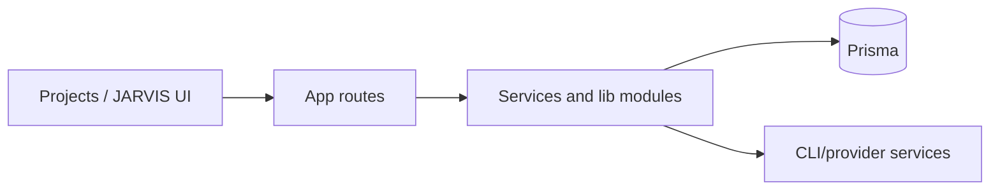

# JARVIS Production Evolution — Baseline Audit

Date: 2026-07-23. Scope: repository-first audit. Existing worktree changes were not modified.

## Evidence summary

| Area | Claimed State | Verified State | Evidence | Gap | Severity | Required Action |
|---|---|---|---|---|---|---|
| T1–T24 | Complete | PARTIALLY VERIFIED | `docs/jarvis/04_task_ledger.md`, `src/lib/jarvis/**`, five test files | Ledger claims exceed runtime evidence | P1 | Re-verify each production claim |
| JARVIS core | Complete | VERIFIED for contracts, graph, checkpoint model | `types.ts`, `state.ts`, `checkpoint-service.ts` | Runtime agent execution is mock | P1 | Connect approved runtime or keep dry-run-only |
| Checkpoint/resume | Working | PARTIALLY VERIFIED | `checkpoint-service.ts`, API run route | No end-to-end persistence evidence in this audit | P2 | Add integration test |
| Browser/CamoFox | Integrated | PARTIALLY VERIFIED | `browser-agent.ts`, CamoFox route/service | No browser-run evidence | P2 | Execute browser suite and retain evidence |
| Infrastructure service | Present | VERIFIED, UNSAFE | `project-infrastructure.service.ts`, `/api/infra/create` | Arbitrary path and immediate GitHub/Vercel/Supabase creation | P0 | Replace with planned, approval-gated operation engine |
| Project UI | Present | VERIFIED | `app/projects/page.tsx` | Calls unsafe endpoint directly | P0 | Route through plan/approval flow |
| Chat/uploads | Present | PARTIALLY VERIFIED | chat route, repository import routes | No unified attachment policy in chat request | P1 | Add validated attachment contract |
| Audio/video | Present | PARTIALLY VERIFIED | `components/jarvis/media-player.tsx` | Visualizer is CSS placeholder, not AudioContext/AnalyserNode | P1 | Implement real analyzer with cleanup |
| YouTube player | Claimed | NOT AVAILABLE | no dedicated component found | Missing | P2 | Add safe mini-player component |
| JSONL ingestion | Present | PARTIALLY VERIFIED | `api/repos/import-batch/route.ts` | Parses refs only; no line ledger, quarantine, canonical manifest | P1 | Add ecosystem ingestion pipeline |
| Providers | Present | PARTIALLY VERIFIED | `lib/ai-provider/**`, provider routes | Attachment capability evidence not unified | P2 | Add capability profiles and checks |

## Repository map

- Next.js App Router application: `src/app/**`; API routes live under `src/app/api/**`.
- Agent Network: `src/lib/jarvis/**`; persistence is Prisma in `prisma/schema.prisma`.
- Existing provider, tool, skill and MCP systems are under `src/lib/ai-provider`, `src/lib/tool-hub`, `src/lib/skills`, and `src/lib/mcp`.
- Browser integrations: `src/lib/browser-operator/**`, `src/services/camofox-browser.service.ts`.
- Existing external infrastructure service: `src/services/project-infrastructure.service.ts`.

## UI and media map

- Layout/top bar: `src/app/layout.tsx`, `src/components/layout/topbar.tsx`.
- JARVIS control center: `src/app/jarvis/page.tsx`, `src/components/jarvis/**`.
- Project creation UI: `src/app/projects/page.tsx`.
- Chat: `src/components/chat/**`, `src/app/api/chat/route.ts`.
- Media: `src/components/jarvis/media-player.tsx`, `src/app/api/media/generate/route.ts`.

## Agent/tool/MCP and infrastructure map

- Registry/planner/orchestrator: `agent-registry.ts`, `planner.ts`, `orchestrator.ts`.
- Tool/MCP discovery adapters: `capability-discovery.ts`, `adapters/mcp-availability-adapter.ts`.
- Browser abstraction: `browser-agent.ts`, `adapters/browser-agent-adapter.ts`.
- API: `/api/jarvis/network`, `/api/infra/create`, `/api/browser/camofox`.

## Data flow

## JSONL inventory

FACT: no `*.jsonl` catalog files were found within the repository (excluding dependencies). Therefore valid/invalid-line counts, schema variants, and duplicate catalog identities are UNKNOWN; no catalog was cloned or installed.

## Baseline commands

| Command | CWD | Exit | Result |
|---|---|---:|---|
| `npm run typecheck` | repository root | 0 | VERIFIED |
| `npx vitest run src/lib/jarvis` | repository root | 0 | 5 files, 22 tests passed |
| `npm run build` | repository root | 0 | VERIFIED; Next warned about an NFT dynamic filesystem trace and deprecated middleware convention |

## Confirmed baseline failures

1. P0 — `/api/infra/create` accepts a client-controlled path and invokes external creation immediately. It has no approval state, safe D-drive normalization, idempotency, or ownership boundary.
2. P1 — `ExecutionEngine.runAgent()` is explicitly a deterministic mock; a successful dry run is not evidence of autonomous implementation.
3. P1 — `MediaPlayer` labels a CSS pulse as a placeholder visualizer; it does not use Web Audio analysis.
4. P1 — JSONL import is only reference parsing and batch analysis; no safe catalog lifecycle exists.

## User-change collision risks

The worktree is already materially dirty across UI, Prisma, routes, JARVIS libraries, and configuration. Treat all such changes as user-owned. New work must use minimal, isolated diffs and never reset or overwrite them.

## Checkpoint

Phase: PROMPT 1 complete. Recommended order: first replace unsafe infrastructure boundary; then attachment/media and ecosystem contracts; then integrate proven components and run browser/security evidence.
