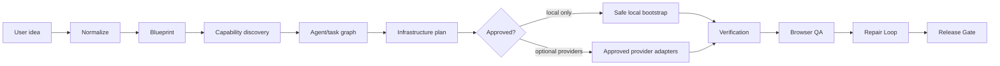

# Target Architecture

The target extends, rather than duplicates, `src/lib/jarvis` and existing service/route layers.

Integration points: `orchestrator.ts`, `agent-registry.ts`, ToolHub and skills/MCP discovery, Browser Operator/CamoFox, verification/repair/release modules, Prisma, App Router routes, current UI, media components, and AI-provider registry.

Each InfrastructureOperation is persisted with an event log and ordered steps: CREATED → VALIDATING → PLANNING → WAITING_APPROVAL → CREATING_LOCAL → optional provider states → VERIFYING → COMPLETED/PARTIAL/BLOCKED/FAILED/CANCELLED. No external transition is legal until approval.
